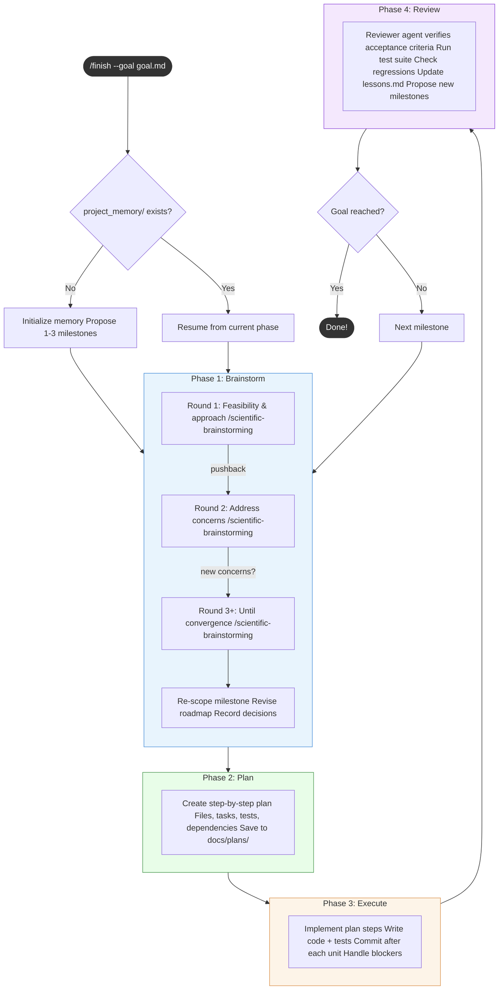

# project-finisher

Ever wish you could hand Claude Code a goal file and walk away while it figures out the architecture, writes the code, tests everything, and keeps going until it's done? That's what this plugin does. You describe what you want, point it at a project, and it runs an iterative loop — brainstorming approaches, planning implementation, writing code, and reviewing its own work — until the goal is met. It remembers where it left off between sessions, so even large projects can be tackled across multiple sittings.

## Workflow Overview



**Roadmap changes** happen at two points: Brainstorm (re-scope, add prerequisites, split, reorder) and Review (propose new milestones, re-prioritize).

**The plugin stops to ask you** when the goal is ambiguous, approaches are equally viable, external resources are needed, the project has diverged from the goal, or the same milestone has failed twice. In `--auto` mode, these are resolved autonomously (except external resources).

## Prerequisites

This plugin depends on skills from these plugins:

| Plugin | Used In | Purpose |
|--------|---------|---------|
| `scientific-skills@claude-scientific-skills` | Brainstorm phase | `/scientific-brainstorming` for feasibility analysis |
| `superpowers@claude-plugins-official` | Plan phase | `/superpowers:write-plan` for structured implementation plans |

Install them first if you don't already have them:

```bash
claude plugin marketplace add https://github.com/K-Dense-AI/claude-scientific-skills.git
claude plugin install scientific-skills@claude-scientific-skills

claude plugin install superpowers@claude-plugins-official
```

## Installation

```bash
# 1. Register the marketplace
claude plugin marketplace add https://github.com/yuanhao96/project-finisher.git

# 2. Install the plugin
claude plugin install project-finisher@project-finisher

# 3. Restart Claude Code to activate
```

## Usage

### Starting a Project

Point the plugin at a goal file that describes what you want to build or finish:

```bash
/finish --goal path/to/goal.md
```

To target a specific project directory (defaults to the current working directory):

```bash
/finish --goal path/to/goal.md --project ./my-project
```

The plugin will read your goal, assess the current state of the project, and begin iterating autonomously until the goal is satisfied.

### Auto Mode

Add `--auto` to run with minimal user interaction. The plugin will make decisions autonomously instead of stopping to ask:

```bash
/finish --goal path/to/goal.md --auto
```

In auto mode:
- Initial milestones are approved automatically
- Brainstorming choices (approach selection, trade-off decisions) are resolved using the recommended or simplest option
- Blocked milestones are re-scoped or skipped after repeated failures
- The only exception is **external resources** (API keys, credentials) — the plugin still stops for those

All autonomous decisions are logged with an `[AUTO]` prefix in `project_memory/current_context.md` so you can review them after the session.

### Continuous Mode

Add `--continuous` (requires `--auto`) to keep the workflow running across session boundaries automatically:

```bash
/finish --goal path/to/goal.md --auto --continuous
```

When Claude's session ends, a Stop hook automatically re-invokes the workflow with a phase-appropriate prompt. The loop continues until all milestones are complete, a blocker is hit, or iteration budgets are exhausted.

Each phase has a default iteration budget:

| Phase | Budget | Rationale |
|-------|--------|-----------|
| brainstorm | 3 | 2-3 rounds typical; more suggests re-scoping needed |
| plan | 2 | Planning should converge quickly |
| execute | 8 | Complex milestones may need multiple sessions |
| review | 3 | Allows re-entry to execute if criteria aren't met |

Total iteration cap across all milestones: 30.

### Other Commands

| Command | Description |
|---------|-------------|
| `/status` | Show current progress — milestone list, phase, and acceptance criteria status |
| `/cancel-loop` | Stop a running continuous loop |

## Architecture

### Skills

| Skill | Purpose |
|-------|---------|
| `orchestrate` | Central brain — drives the brainstorm/plan/execute/review loop and manages milestone progression |
| `memory` | Manages the markdown-based memory files (read/write procedures, file formats) |
| `evolve` | Learns your working style across sessions (pacing, depth, tool preferences) and adapts the orchestrator |

### Agents

| Agent | Purpose |
|-------|---------|
| `reviewer` | Independent verification of milestone acceptance criteria after execution completes |

### Hooks

| Hook | Purpose |
|------|---------|
| `SessionStart` | Reminds Claude to run the evolve skill's Observe & Extract procedure |
| `PostToolUse` | Logs tool usage to `behavior_log.jsonl` for behavioral analysis (rolling window, last 100 entries) |
| `Stop` | In continuous mode, re-invokes the workflow instead of exiting |

## Memory Files

The plugin persists state across sessions in a `project_memory/` directory at the root of your project:

| File | Purpose |
|------|---------|
| `project_memory/progress.md` | Tracks completed tasks, current phase, and overall progress toward the goal |
| `project_memory/current_context.md` | Captures the active working context — what was just done, what comes next, and any open questions |
| `project_memory/lessons.md` | Records lessons learned during execution — things that worked, things that didn't, and decisions made |

These files are read at the start of each session so the plugin can pick up exactly where it left off.

### Self-Evolution Data

The plugin also stores cross-project behavioral data in `~/.claude/project-finisher-data/`:

| File | Purpose |
|------|---------|
| `behavior_log.jsonl` | Rolling log of tool usage (last 100 entries, auto-pruned) |
| `workflow_preferences.md` | Learned preferences for pacing, depth, workflow ordering, and tool usage |

The evolve skill reads these at startup and updates them at session end, so the orchestrator gradually adapts to your working style.

## License

MIT
