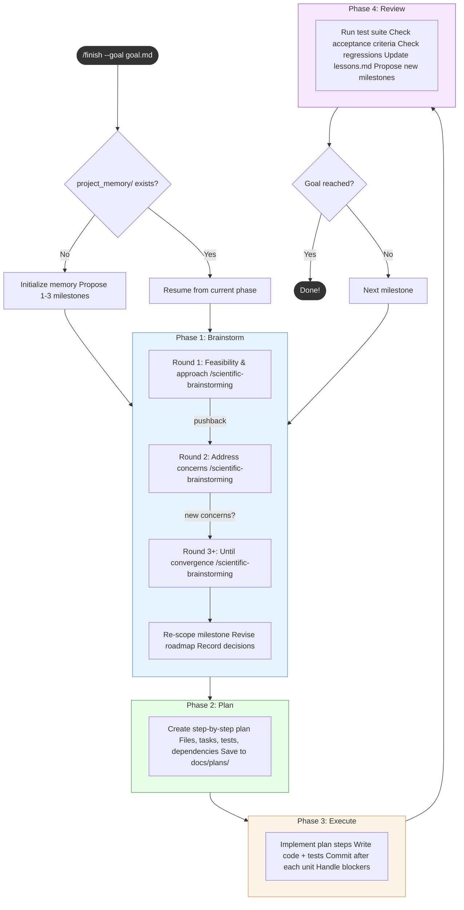

# project-finisher

Ever wish you could hand Claude Code a goal file and walk away while it figures out the architecture, writes the code, tests everything, and keeps going until it's done? That's what this plugin does. You describe what you want, point it at a project, and it runs an iterative loop — brainstorming approaches, planning implementation, writing code, and reviewing its own work — until the goal is met. It remembers where it left off between sessions, so even large projects can be tackled across multiple sittings.

## Workflow Overview



**Roadmap changes** happen at two points: Brainstorm (re-scope, add prerequisites, split, reorder) and Review (propose new milestones, re-prioritize).

**The plugin stops to ask you** when the goal is ambiguous, approaches are equally viable, external resources are needed, the project has diverged from the goal, or the same milestone has failed twice.

## Prerequisites

This plugin depends on skills from these plugins:

| Plugin | Used In | Purpose |
|--------|---------|---------|
| `scientific-skills@claude-scientific-skills` | Brainstorm phase | `/scientific-brainstorming` for feasibility analysis |
| `superpowers@claude-plugins-official` | Plan phase | `/superpowers:write-plan` for structured implementation plans |

Install them first if you don't already have them:

```bash
claude plugin marketplace add https://github.com/K-Dense-AI/claude-scientific-skills.git
claude plugin install scientific-skills@claude-scientific-skills

claude plugin install superpowers@claude-plugins-official
```

## Installation

```bash
# 1. Register the marketplace
claude plugin marketplace add https://github.com/yuanhao96/project-finisher.git

# 2. Install the plugin
claude plugin install project-finisher@project-finisher

# 3. Restart Claude Code to activate
```

## Usage

Point the plugin at a goal file that describes what you want to build or finish:

```bash
/finish --goal path/to/goal.md
```

To target a specific project directory (defaults to the current working directory):

```bash
/finish --goal path/to/goal.md --project ./my-project
```

The plugin will read your goal, assess the current state of the project, and begin iterating autonomously until the goal is satisfied.

## Memory Files

The plugin persists state across sessions in a `project_memory/` directory at the root of your project:

| File | Purpose |
|------|---------|
| `project_memory/progress.md` | Tracks completed tasks, current phase, and overall progress toward the goal. |
| `project_memory/current_context.md` | Captures the active working context — what was just done, what comes next, and any open questions. |
| `project_memory/lessons.md` | Records lessons learned during execution — things that worked, things that didn't, and decisions made along the way. |

These files are read at the start of each session so the plugin can pick up exactly where it left off.

## License

MIT
